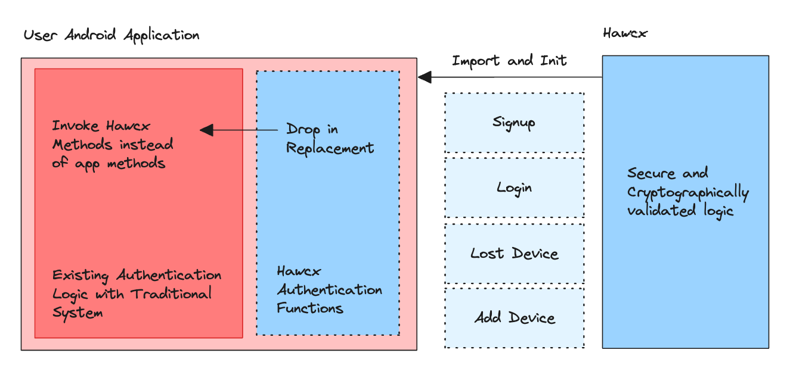

# Android

## 1. Introduction

Welcome to the HawcxFramework documentation. HawcxFramework is a cutting-edge security solution designed to provide robust authentication and data protection for mobile applications. As businesses and individuals increasingly rely on mobile apps for sensitive operations, the need for advanced security measures has never been more critical.

HawcxFramework offers a comprehensive suite of security features, including:

- Secure user authentication
- Biometric integration
- Advanced encryption protocols
- Secure key management
- Protection against common mobile app vulnerabilities

Whether you're developing a financial app, a healthcare solution, or any application that handles sensitive user data, HawcxFramework provides the tools you need to ensure your users' information remains secure.

This documentation will guide you through the process of integrating HawcxFramework into your mobile applications, regardless of whether you're building a native Android app or using cross-platform frameworks like React Native or Flutter.

## 2. How does Hawcx Work

HawcxFramework employs a multi-layered approach to security, combining several advanced techniques to protect user data and prevent unauthorized access.

### Key Components:

1. **Secure Authentication**: HawcxFramework uses a proprietary authentication protocol that goes beyond traditional username/password systems. It incorporates elements of challenge-response authentication and time-based tokens to ensure that each login attempt is unique and resistant to replay attacks.

2. **Biometric Integration**: Leveraging the device's built-in biometric capabilities, HawcxFramework allows for seamless and secure biometric authentication, adding an extra layer of security without compromising user experience.

3. **Encryption**: All sensitive data is encrypted using industry-standard AES-256 encryption. HawcxFramework handles key generation, rotation, and secure storage, ensuring that even if a device is compromised, the encrypted data remains secure.

4. **Secure Communication**: HawcxFramework implements certificate pinning and robust TLS protocols to ensure that all communication between the app and your servers is secure and resistant to man-in-the-middle attacks.

5. **Tamper Detection**: The framework includes mechanisms to detect if an app has been tampered with or is running in an unsecured environment, helping to prevent reverse engineering and other forms of attack.

 

 

### Workflow:

1. When a user registers or logs in, HawcxFramework generates a unique set of cryptographic keys for that user.
2. These keys are used in combination with server-side challenges to authenticate the user securely.
3. Once authenticated, HawcxFramework provides secure storage for session tokens and other sensitive data.
4. All operations involving sensitive data (reading, writing, transmitting) are handled through the HawcxFramework, ensuring consistent security measures are applied.

By handling these complex security operations, HawcxFramework allows developers to focus on building great features while ensuring their app meets the highest security standards.

## 3. Sample Application

[Content for this section will be added later]

## 4. Get Started

[Content for this section will be added later]

## 5. First Steps

[Content for this section will be added later]

## 6. Integration in Java Application

[Content for this section will be added later]

## 7. Integration in React Application

[Content for this section will be added later]

## 8. Integrate in Flutter Application

[Content for this section will be added later]

## 9. Next Steps

[Content for this section will be added later]

## 10. Feature Requests

[Content for this section will be added later]